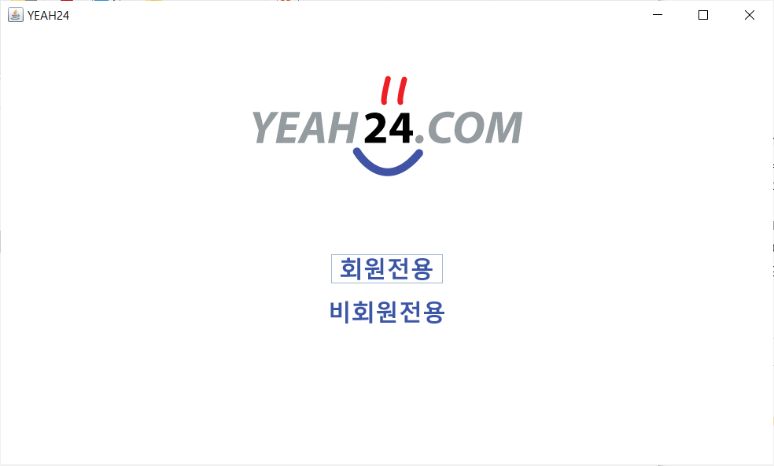
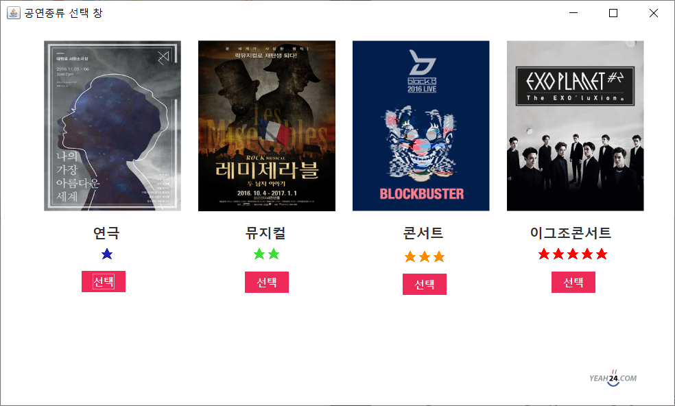
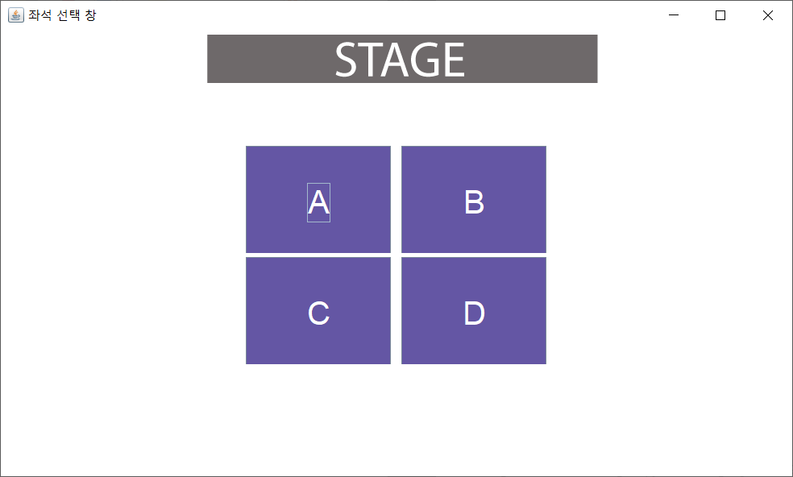
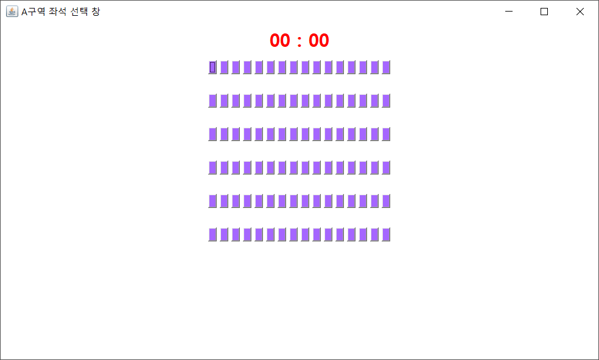
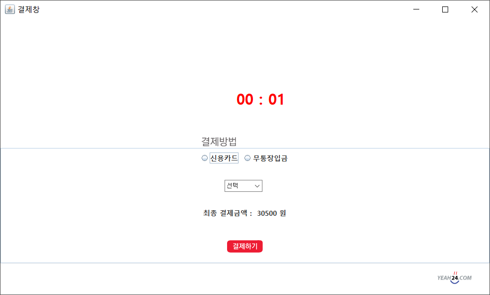
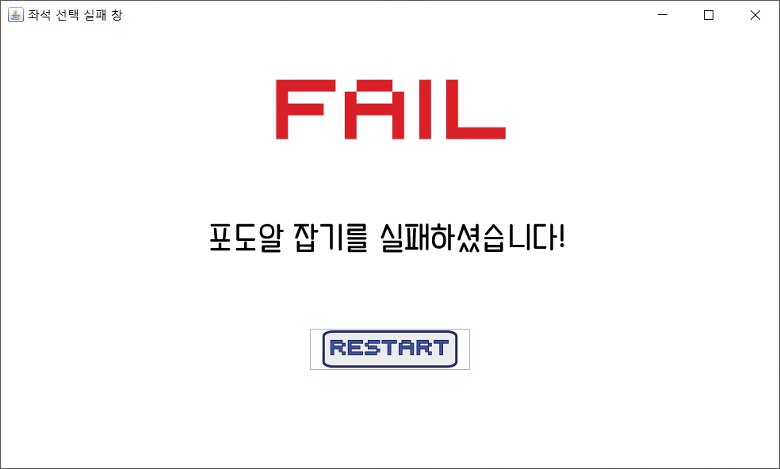
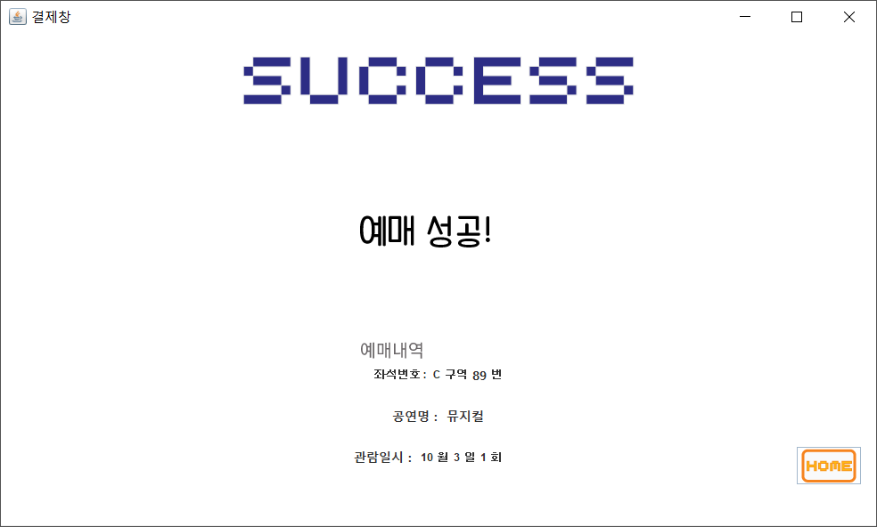

# YEAH24
YEAH24는 티켓팅 연습 프로그램으로, 실제로 티켓팅하는 과정을 그대로 재현했습니다.

<p align="center">
    
</p>

## 👀 프로젝트 소개
좌석을 한 번 놓치면 다시 잡기 어려운 티켓팅을 연습하기가 마땅치 않아 많은 사람들이 실패합니다. 그래서 저희는 티켓팅을 연습하고 대비할 수 있도록 하는 프로그램인 티켓팅 연습 프로그램을 구현하기로 했습니다.

이 프로그램은 YES24나 G마켓 등과 같은 홈페이지를 최대한 사실적으로 표현하였고 실제 티켓팅하는 과정을 그대로 재현했습니다. 공연 종류와 날짜, 그리고 시간과 회차를 선택하고 나서 좌석을 선택하는 부분, 선택한 좌석에 대한 결제를 하는 부분에서 시간 제한을 두어 게임 형식으로 구현했습니다.

### ▼ 진행 규칙 및 성공 여부
01. 공연 종류와 날짜, 회차를 모두 빠짐없이 선택해야 합니다.
02. 좌석을 선택하는 창에서 제한 시간이 생깁니다.
03. 공연 정보에 따라 난이도가 달라집니다. 난이도는 1단계부터 4단계까지이며 높을수록 제한 시간이 짧습니다.
04. 좌석 선택 창 다음으로 결제 방법 창이 뜹니다. 이 창에서도 제한 시간이 있습니다.
05. 이 두 과정을 제한 시간 안에 모두 성공해야 티켓팅에 성공합니다.
06. 0.1초라도 늦을 경우 화면이 클릭되지 않으며 전 화면으로 이동합니다.

## 💻 프로젝트 실행
비회원으로 실행하는 것을 추천합니다!

### ▼ 회원으로 실행

#### 1) MySQL 설치

#### 2) 아래의 순서대로 DB 입력
```
create database ticketing;
```

```
use ticketing;
```

```
create table member(
	id varchar(15) primary key,
	pwd varchar(15),
	name varchar(13),
	tel varchar(15),
	showtype varchar(16),
	area varchar(2),
	payment varchar(16),
	bank varchar(13),
	month int(11),
	day int(11),
	inning int(11),
	amount int(11),
	seatnum int(11)
);
```

#### 3) git clone으로 프로젝트 내려받기
```
git clone https://github.com/unauthorized-401/Ticketing.git
```

#### 4) IntelliJ나 Eclipse에서 프로그램 실행

### ▼ 비회원으로 실행

#### 1) git clone으로 프로젝트 내려받기
```
git clone https://github.com/unauthorized-401/Ticketing.git
```

#### 2) 실행 파일 (last.exe) 실행

## 📸 서비스 스크린샷

<p align="center">
    
    
</p>
<p align="center">
    
    
</p>
<p align="center">
    
    
</p>